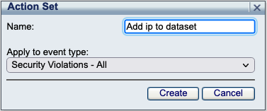
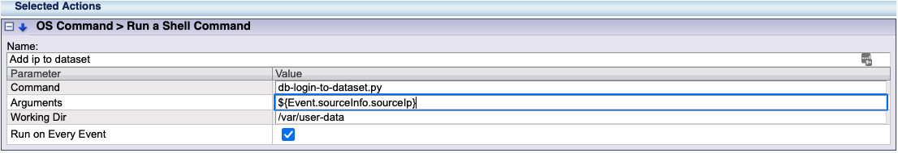

# SecureSphere DB Login to Dataset

This project provides the scripts and configuration steps needed to identify db client hostnames (by prefixes) segmenting workstations, non-workstations, and unresolved hosts into datasets.  These datasets can then be used as predicates in security and audit policies for granular monitoring and alerting by client hostnames in DHCP networks universally for all databsae service types. 

#### Step 1: Download and copy script and config to the managemnt server (MX)

1. Download and copy the files into a new directory (/var/user-data) on the Management Server (MX):
    - SSH to the MX, and create the following directory, which is the supported folder for running custom scritps.  
        >`mkdir /var/user-data`
    - Download the following files and copy them into the the /var/user-data folder:  
        >`/db-login-to-dataset/db-login-to-dataset.py`
        `/template.config.json`
        `/ss.py`
    - Rename template.config.json to config.json  
        >`cd /var/user-data`  
        `mv template.config.json config.json`  
1. Update the configuration file with your endpoints and credentials, see **Configuration Options** below:
1. Update file permissions:
    - Make script executable, and change ownership of the file to the mxserver user, so the script can be executed from the action set.
        > `chmod +x db-login-to-dataset.py`  
        `chmod mxserver:mxserver db-login-to-dataset.py`

1. Create Action Set in the MX
    - Login to the MX, and navigate to Policies->Action Sets. Click the  icon to add a new action set.  
    Name: `Add ip to dataset`  
    Apply to event type: `Security Violation - All`  
      
1. Click the  icon to add `OS Command > Run a Shell Command` to add this action to the `Selected Actions` in the action set.
1. Click the  button to expand the action configuration, add the following configuration parameter values, then click save.
    - Command: `db-login-to-dataset.py`  
    - Arguments: `${Event.irregularBehaviors.alert.sourceIp}`  
    - Working Dir: `/var/user-data`  
    - Run on Every Event:   
    
1. Navigate to Policies->Security, select any security policy and assign `Create SNOW Incident` as the `Followed Action`.
    

### Configuration Options ###

The script has one configuration file, which lives in the same directory as the script.

### config.json ###

Rename template.config.json to config.json.  The `config.json` configuration file is where the SecureSphere and ServiceNow configurations live. 

Example:

```
{
    "log_level": "debug",
    "environment": "dev",
    "mx": {
        "endpoint": "https://127.0.0.1:8083",
        "username": "your_username",
        "password": "your_password_here"
    },
    "servicenow": {
        "endpoint": "http://your.service-now.com",
        "username": "your_username",
        "password": "your_password_here"
    }
}
```

#### Config Options ####

`log_level` - _(optional)_ the log level. Valid values: `debug`, `info`, `warn`, `error`, `fatal`. Defaults to `info`.

`environment` - _(optional)_ the logical environment the server operates in.  This value will be reported with every Event.  Ex. `dev`, `stage`, `uat`, `prod`.  Defaults to `dev`

`mx.endpoint` - _(required)_ endpoint of the mx, typically run from localhost/127.0.0.1

`mx.username` - _(required)_ the username of the user authenticating to the MX API 

`mx.password` - _(required)_ the password of the user authenticating to the MX API 

`servicenow.endpoint` - _(required)_ endpoint of the servicenow instance

`servicenow.username` - _(required)_ the username of the user authenticating to the servicenow API 

`servicenow.password` - _(required)_ the password of the user authenticating to the servicenow API 