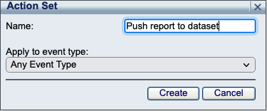
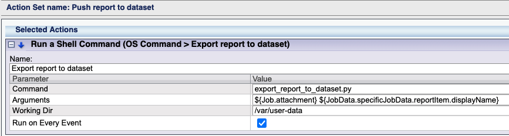
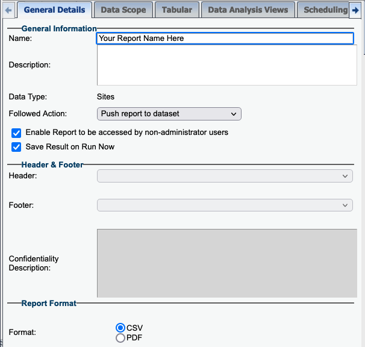

# SecureSphere Export Report to Dataset

This project provides the scripts and configuration steps needed to export a csv report, and dynamically create a dataset pushing the contents of the report into that dataset as a followed action. 

#### Step 1: Download and copy script and config to the managemnt server (MX)

1. Download and copy the files into a new directory (/var/user-data) on the Management Server (MX):
    - SSH to the MX, and create the following directory, which is the supported folder for running custom scritps.  
        >`mkdir /var/user-data`
    - Download the following files and copy them into the the /var/user-data folder:  
        >`/db-login-to-dataset/export_report_to_dataset.py`
        `/template.config.json`
        `/ss.py`
    - Rename template.config.json to config.json  
        >`cd /var/user-data`  
        `mv template.config.json config.json`  
1. Update the configuration file with your endpoints and credentials, see **Configuration Options** below:
1. Update file permissions:
    - Make script executable, and change ownership of the file to the mxserver user, so the script can be executed from the action set.
        > `chmod +x export_report_to_dataset.py`  
        `chmod mxserver:mxserver export_report_to_dataset.py`

1. Create Action Set in the MX
    - Login to the MX, and navigate to Policies->Action Sets. Click the  icon to add a new action set.  
    Name: `Push report to dataset`  
    Apply to event type: `Any Event Type`  
      
1. Click the  icon to add `OS Command > Run a Shell Command` to add this action to the `Selected Actions` in the action set.
1. Click the  button to expand the action configuration, add the following configuration parameter values, then click save.
    - Name: `Export report to dataset`  
    - Command: `export_report_to_dataset.py`  
    - Arguments: `${Job.attachment} ${JobData.specificJobData.reportItem.displayName}`  
    - Working Dir: `/var/user-data`  
    - Run on Every Event:   
    
1. Navigate to Reports->Manage Reports, select the desired .csv report ensuring the format is .csv, and select `Export report to dataset` as the `Followed Action`.  
    

### Configuration Options ###

The script has one configuration file, which lives in the same directory as the script.

### config.json ###

Rename template.config.json to config.json.  The `config.json` configuration file is where the SecureSphere and ServiceNow configurations live. 

Example:

```
{
    "log_level": "debug",
    "environment": "dev",
    "mx": {
        "endpoint": "https://127.0.0.1:8083",
        "username": "youruser",
        "password": "yourpassword"
    }
}
```

#### Config Options ####

`log_level` - _(optional)_ the log level. Valid values: `debug`, `info`, `warn`, `error`, `fatal`. Defaults to `info`.

`environment` - _(optional)_ the logical environment the server operates in.  This value will be reported with every Event.  Ex. `dev`, `stage`, `uat`, `prod`.  Defaults to `dev`

`mx.endpoint` - _(required)_ endpoint of the mx, typically run from localhost/127.0.0.1

`mx.username` - _(required)_ the username of the user authenticating to the MX API 

`mx.password` - _(required)_ the password of the user authenticating to the MX API 
