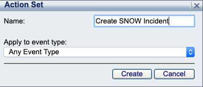
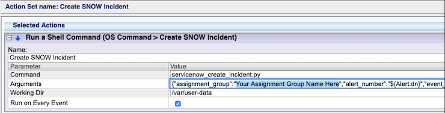
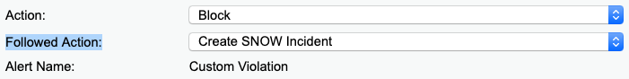
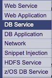
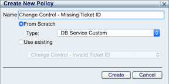
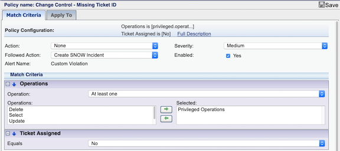
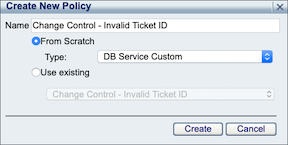
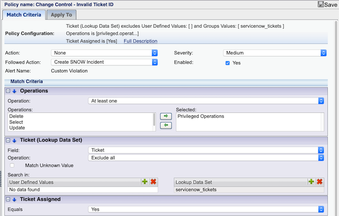

# SecureSphere ServiceNow Integration - Alert to Incident

This project provides the scripts and configuration steps needed to integrate SecureSphere with ServiceNow to dynamically create incidents when security alerts are generated.  

#### Step 1: Download and copy script and config to the managemnt server (MX)

1. Download and copy the files into a new directory (/var/user-data) on the Management Server (MX):
    - SSH to the MX, and create the following directory, which is the supported folder for running custom scritps.  
        >`mkdir /var/user-data`
    - Download the following files and copy them into the the /var/user-data folder:  
        >`/servicenow/alert_to_incident/servicenow_create_incident.py`  
        `/template.config.json`  
        `/ss.py`  
    - Rename template.config.json to config.json  
        >`cd /var/user-data`  
        `mv template.config.json config.json`  
1. Update the configuration file with your endpoints and credentials, see **Configuration Options** below:
1. Update file permissions:
    - Make script executable, and change ownership of the file to the mxserver user, so the script can be executed from the action set.  
        > `chmod +x servicenow_create_incident.py`  
        `chmod mxserver:mxserver servicenow_create_incident.py`
1. Create Action Set in the MX
    - Login to the MX, and navigate to Policies->Action Sets. Click the  icon to add a new action set.  
    Name: `Create SNOW Incident`  
      
1. Click the  icon to add `OS Command > Run a Shell Command` to add this action to the `Selected Actions` in the action set.
1. Click the  button to expand the action configuration, add the following configuration parameter values.  Insert your SNOW assignment group name into the assignment_group attribute of the json string in the argument field as shown `Your Assignment Group Name Here` in the screenshot, then click save.
    - Command: `servicenow_create_incident.py`  
    - Arguments: `{"assignment_group":"Your Assignment Group Name Here","alert_number":"${Alert.dn}","event_id":"${Event.dn}","alert_desc":"${Alert.description}","user":"${Alert.username}","source-ip":"${Event.sourceInfo.sourceIp}","object-name":"${Event.struct.operations.objects.name}","object-type":"${Event.struct.operations.objectType}","violated-item":"${Event.violations.violatedItem}"}`  
    - Working Dir: `/var/user-data`  
    - Run on Every Event:   
    **Note: Alerts be default will aggregate many individual violations. If `Run on Every Event` is unchecked, an incident will be created upon the creation of a new alert. If checked, a new incident will be created in ServiceNow every time the security policy triggers for every violation. **
        
1. Navigate to Policies->Security, select any security policy and assign `Create SNOW Incident` as the `Followed Action`.
    

### Create change control security policies (optional) ###
**NOTE:** If you have already configured a dataset with valid ticket ids (see [import_change_request_ids](https://github.com/imperva/mx-toolbox/tree/master/servicenow/import_change_request_ids)), you can create `Change Control - Missing Ticket ID` and `Change Control - Missing Ticket ID` security policies to alert when the change control process is not being followed.   


1. Create `Change Control - Missing Ticket ID` change control security policy
    - Navigate to Policies->Security, click the  icon to add a new `DB Service` security policy.  
        
    - Navigate to Policies->Security, click the  icon to add a new security policy.  Enter the name of the policy, select policy type anc click create.   
        Name: `Change Control - Missing Ticket ID`  
        Type: `DB Service Custom`  
        
    - Click the  icon to add the `Operations` and `Ticket Assigned` predicates to `Match Criteria` in the security policy.
    - Click the  button to expand the predicate configurations, add the following configuration parameter values, and click save.  
        Operations->Operation: `At Least one`  
        Operations->Selected: `Privileged Operations`  
        Ticket Assigned->Equals: `No`  
        
    - Assign `Create SNOW Incident` as the `Followed Action`.  
          

1. Create `Change Control - Invalid Ticket ID` change control security policy
    - Navigate to Policies->Security, click the  icon to add a new `DB Service` security policy.  
        
    - Navigate to Policies->Security, click the  icon to add a new security policy.  Enter the name of the policy, select policy type anc click create.   
        Name: `Change Control - Invalid Ticket ID`  
        Type: `DB Service Custom`  
        
    - Click the  icon to add the `Operations`, `Lookup Data Set Search` and `Ticket Assigned` predicates to `Match Criteria` in the security policy.
    - Click the  button to expand the predicate configurations, add the following configuration parameter values, and click save.  
        Operations->Operation: `At Least one`  
        Operations->Selected: `Privileged Operations`  
        Lookup Data Set->Field: `Ticket`  
        Lookup Data Set->Operation: `Exclude All`  
        Lookup Data Set->Lookup Data Set: `servicenow_tickets`  
        Ticket Assigned->Equals: `Yes`  
        
    - Assign `Create SNOW Incident` as the `Followed Action`.  
          

### Configuration Options ###

The script has one configuration file, which lives in the same directory as the script.

### config.json ###

Rename template.config.json to config.json.  The `config.json` configuration file is where the SecureSphere and ServiceNow configurations live. 

Example:

```
{
    "log_level": "debug",
    "environment": "dev",
    "mx": {
        "endpoint": "https://127.0.0.1:8083",
        "username": "your_username",
        "password": "your_password_here"
    },
    "servicenow": {
        "endpoint": "http://your.service-now.com",
        "username": "your_username",
        "password": "your_password_here"
    }
}
```

#### Config Options ####

`log_level` - _(optional)_ the log level. Valid values: `debug`, `info`, `warn`, `error`, `fatal`. Defaults to `info`.

`environment` - _(optional)_ the logical environment the server operates in.  This value will be reported with every Event.  Ex. `dev`, `stage`, `uat`, `prod`.  Defaults to `dev`

`mx.endpoint` - _(required)_ endpoint of the mx, typically run from localhost/127.0.0.1

`mx.username` - _(required)_ the username of the user authenticating to the MX API 

`mx.password` - _(required)_ the password of the user authenticating to the MX API 

`servicenow.endpoint` - _(required)_ endpoint of the servicenow instance

`servicenow.username` - _(required)_ the username of the user authenticating to the servicenow API 

`servicenow.password` - _(required)_ the password of the user authenticating to the servicenow API 