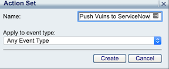
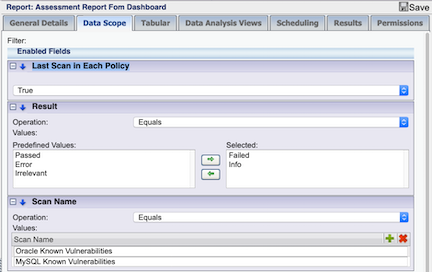
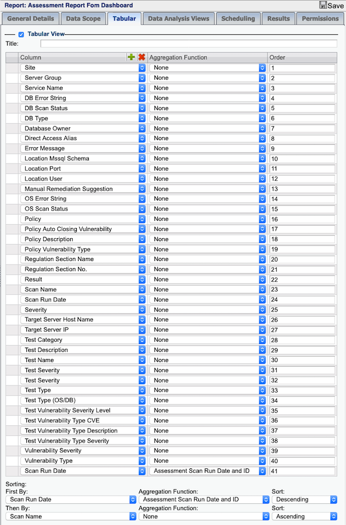

# SecureSphere ServiceNow Integration - Import Change Request IDs

This project provides the scripts and configuration steps needed to export vulnerability assessment report data, and create Vulnerable Items in ServiceNow referencing existing Configuration Items by the IP address of the server scanned, or creating new Configuration Items if the scanned server ip is not found. 

#### Step 1: Download and copy script and config to the managemnt server (MX)

1. Download and copy the files into a new directory (/var/user-data) on the Management Server (MX):
    - SSH to the MX, and create the following directory, which is the supported folder for running custom scritps.  
        >`mkdir /var/user-data`
    - Download the following files and copy them into the the /var/user-data folder:  
        >`/servicenow/assessment_report_to_vulnerable_items/servicenow_process_das_report.py`  
        `/template.config.json`  
        `/ss.py`  
    - Rename template.config.json to config.json  
        >`cd /var/user-data`  
        `mv template.config.json config.json`  
1. Update the configuration file with your endpoints and credentials, see **Configuration Options** below:
1. Update file permissions:
    - Make script executable, and change ownership of the file to the mxserver user, so the script can be executed from the action set.  
        > `chmod +x servicenow_process_das_report.py`  
        `chmod mxserver:mxserver servicenow_process_das_report.py`  
1. Create Action Set in the MX
    - Login to the MX, and navigate to Policies->Action Sets. Click the  icon to add a new action set.  
    Name: `Push Vulns to ServiceNow`  
      
1. Click the  icon to add `OS Command > Run a Shell Command` to add this action to the `Selected Actions` in the action set.
1. Click the  button to expand the action configuration, add the following configuration parameters values, and click save  
    - Command: `servicenow_process_das_report.py`  
    - Arguments: `${Job.attachment}`  
    - Working Dir: `/var/user-data`  
    - Run on Every Event:   
        

1. Import the audit report, or create audit report from scratch. 
   ### Import report instructions ###
    - Navigate to Main->Reports->Manage Reports->Action->Import  
    Select assessment_report_to_vulnerable_items/assets/vuln_assessment_report_export.imf, enter passphrase "`vulnreport`" and click upload.  
    Ensure "`Action Set`" is correctly mapped to "`Push Vulns to ServiceNow`" and click Import.
   ### Create audit report from scratch instructions ###
    - Navigate to Main->Reports->Manage Reports, and click the  icon to add a new `DB Audit` report, enter the report name and click create.  
    Name: `Assessment Report Fom Dashboard`
    - Configure the following parameters on the report and click Save.  
        * General Details->Followed Action: `Push Audit to ServiceNow Change Tickets`  
        * General Details->Format: `CSV`  
        * Data Scope->Last Scan in Each Policy: `True`  
        * Data Scope->Enabled Fields: Click  to add `Result`: Failed, Info
        * Data Scope->Enabled Fields: Click  to add `Scan Name`: Enter all applicable Scan Names
        
        * Tabular: Add the following fields to the report, and click save:  
        
    - Select Action->Run Report to run the report.  
    - Log in to ServiceNow to validate that the audit queries are updated on the change requests with the correlating change request numbers.  
    [Example Vulnerable Assessment Scan Result](https://github.com/imperva/mx-toolbox/blob/master/servicenow/assessment_report_to_vulnerable_items/screenshots/vuln_assessment_scan_results.png)  
    [Example Scan Results Imported as ServiceNow Vulnerable Items](https://github.com/imperva/mx-toolbox/blob/master/servicenow/assessment_report_to_vulnerable_items/screenshots/servicenow_vulnerable_items.png)  
    [Example Imported ServiceNow Vulnerable Item](https://github.com/imperva/mx-toolbox/blob/master/servicenow/assessment_report_to_vulnerable_items/screenshots/servicenow_vulnerable_item.png)  
    
### Configuration Options ###

The script has one configuration file, which lives in the same directory as the script.

### config.json ###

The `config.json` configuration file is where New Relic specific configuration lives. 

Example:

```
{
    "log_level": "debug",
    "environment": "dev",
    "mx": {
        "endpoint": "https://127.0.0.1:8083",
        "username": "your_username",
        "password": "your_password_here"
    },
    "servicenow": {
        "endpoint": "http://your.service-now.com",
        "username": "your_username",
        "password": "your_password_here"
    }
}
```

#### Config Options ####

`log_level` - _(optional)_ the log level. Valid values: `debug`, `info`, `warn`, `error`, `fatal`. Defaults to `info`.

`environment` - _(optional)_ the logical environment the server operates in.  This value will be reported with every Event.  Ex. `dev`, `stage`, `uat`, `prod`.  Defaults to `dev`

`mx.endpoint` - _(required)_ endpoint of the mx, typically run from localhost/127.0.0.1

`mx.username` - _(required)_ the username of the user authenticating to the MX API 

`mx.password` - _(required)_ the password of the user authenticating to the MX API 

`servicenow.endpoint` - _(required)_ endpoint of the servicenow instance

`servicenow.username` - _(required)_ the username of the user authenticating to the servicenow API 

`servicenow.password` - _(required)_ the password of the user authenticating to the servicenow API 