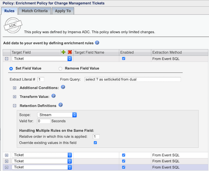
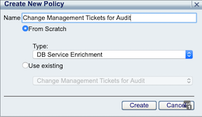
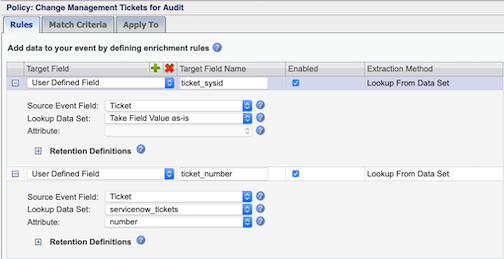

# SecureSphere ServiceNow Integration - Import Change Request IDs

This project provides the scripts and configuration steps needed to configure Change Control Reconciliation with ServiceNow.  

#### Step 1: Download and copy script and config to the managemnt server (MX)

1. Download and copy the files into a new directory (/var/user-data) on the Management Server (MX):
    - SSH to the MX, and create the following directory, which is the supported folder for running custom scritps.  
        >`mkdir /var/user-data`
    - Download the following files and copy them into the the /var/user-data folder:  
        >`/servicenow/import_change_request_ids/servicenow_load_change_request_ids.py`  
        `/template.config.json`  
        `/ss.py`  
    - Rename template.config.json to config.json  
        >`cd /var/user-data`  
        `mv template.config.json config.json`  
1. Update the configuration file with your endpoints and credentials, see **Configuration Options** below:
1. Update file permissions:
    - Make script executable, and change ownership of the file to the mxserver user, so the script can be executed from the action set.  
        > `chmod +x servicenow_load_change_request_ids.py`  
        `chmod mxserver:mxserver servicenow_load_change_request_ids.py`  
1. Run the script manually first as the mxserver user to verify everything is working, then configure script to run on a cron.
    - Manually run the script using the following command.
        >`cd /var/user-data`  
        `su mxserver`  
        `./servicenow_load_change_request_ids.py`  
    - Login to the MX, and navigate to Setup->Global Objects, verify that the servicenow_tickets dataset is created, and is populated with the desired change requests. 
    - Add cron to MX automate the import process of tickets.  The following example cron syntax will execute this script every 5 minutes. 
        >`crontab -e`  
        >`*/5 * * * * /usr/bin/python /var/user-data/servicenow_load_change_request_ids.py`  
1. Apply out-of-the-box Enrichment Policy for Change Management Tickets.  This policy will help map the benign set ticket query for each database service type to the subsequent queries observed by DAM.  
    - Navigate to Policies->Data Enrichment.  Select the `Enrichment Policy for Change Management Tickets` policy, click the `Apply To` tab, and check all of the applicable database services where change control reconciliation is applicable.   
    **NOTE: Adjust the Retention Definitions on the enrichment policy as appropriate for environment:**  
    Retention Definitions: 
        * Event: Enriches individual events as they are identified by SecureSphere.
        * Stream: Enriches all events that appear in a TCP Stream. Additionally enables the setting of a timeout.
        * User: Enriches all events that belong to a specific user.
        * Source IP: Enriches all events belonging to a specific IP address.  
      

1. Add `Change Management Tickets for Audit` enrichment policy.  
    By default, the the value of the ticket ID (servicenow sys_id) is only visible where raw queries are captured (phase 2 audit), which requires `Event` data to be checked on audit policies.  We can create an additional enrichment policy to populate the standard `Audit->DB Audit Data` screen (phase 1 audit) with both the ticket sys_id and number. 
    - Click the  icon to add a new data enrichment policy.  
    Name: `Change Management Tickets for Audit`  
      
    - Click the  twice to add ticket_sysid, and ticket_numnber as `User Defined Fields`.  
    [1] Target Field Name:  `ticket_sysid`  
    [1] Source Event Field: `Ticket`  
    [1] Lookup Data Set:  `Take Field Value as-is`  
    [1] Attribute:    
    [2] Target Field Name:  `ticket_numnber`  
    [2] Source Event Field: `Ticket`  
    [2] Lookup Data Set:  `servicenow_tickets`  
    [2] Attribute: `number`  
      

### Configuration Options ###

The script has one configuration file, which lives in the same directory as the script.

### config.json ###

The `config.json` configuration file is where New Relic specific configuration lives. 

Example:

```
{
    "log_level": "debug",
    "environment": "dev",
    "mx": {
        "endpoint": "https://127.0.0.1:8083",
        "username": "your_username",
        "password": "your_password_here"
    },
    "servicenow": {
        "endpoint": "http://your.service-now.com",
        "username": "your_username",
        "password": "your_password_here"
    }
}
```

#### Config Options ####

`log_level` - _(optional)_ the log level. Valid values: `debug`, `info`, `warn`, `error`, `fatal`. Defaults to `info`.

`environment` - _(optional)_ the logical environment the server operates in.  This value will be reported with every Event.  Ex. `dev`, `stage`, `uat`, `prod`.  Defaults to `dev`

`mx.endpoint` - _(required)_ endpoint of the mx, typically run from localhost/127.0.0.1

`mx.username` - _(required)_ the username of the user authenticating to the MX API 

`mx.password` - _(required)_ the password of the user authenticating to the MX API 

`servicenow.endpoint` - _(required)_ endpoint of the servicenow instance

`servicenow.username` - _(required)_ the username of the user authenticating to the servicenow API 

`servicenow.password` - _(required)_ the password of the user authenticating to the servicenow API 